# Tutorial: Integración de Atlassian Cloud con Azure Active Directory

En este tutorial, aprenderá a integrar Atlassian Cloud con Azure Active Directory (Azure AD). Al integrar Atlassian Cloud con Azure AD, puede hacer lo siguiente:

* Controlar en Azure AD quién tiene acceso a Atlassian Cloud.
* Permitir que los usuarios puedan iniciar sesión automáticamente en Atlassian Cloud con sus cuentas de Azure AD.
* Administrar las cuentas desde una ubicación central (Azure Portal).

## Requisitos previos

Para empezar, necesita los siguientes elementos:

* Una suscripción de Azure AD. Si no tiene una suscripción, puede crear una [cuenta gratuita](https://azure.microsoft.com/free/).
* Una suscripción habilitada para el inicio de sesión único (SSO) en Atlassian Cloud.
* Para habilitar el inicio de sesión único en Lenguaje de marcado de aserción de seguridad (SAML) para productos de Atlassian Cloud, debe configurar Atlassian Access. Más información sobre [Atlassian Access]( https://www.atlassian.com/enterprise/cloud/identity-manager).

> [!NOTE]
> Esta integración también está disponible para usarse desde el entorno de la nube del gobierno de EE. UU de Azure AD. Puede encontrar esta aplicación en la galería de aplicaciones de la nube del gobierno de EE. UU. de Azure AD y configurarla de la misma manera que en la nube pública.

## Descripción del escenario

En este tutorial, va a configurar y probar el inicio de sesión único de Azure AD en un entorno de prueba. 

* Atlassian Cloud admite SSO iniciado por **SP e IDP**.
* Atlassian Cloud admite el [aprovisionamiento y desaprovisionamiento automático de usuarios](atlassian-cloud-provisioning-tutorial.md).

## Agregar Atlassian Cloud desde la galería

Para configurar la integración de Atlassian Cloud en Azure AD, necesita agregar Atlassian Cloud desde la galería a la lista de aplicaciones SaaS administradas.

1. Inicie sesión en Azure Portal con una cuenta personal, profesional o educativa de Microsoft.
1. En el panel de navegación de la izquierda, seleccione el servicio **Azure Active Directory**.
1. Vaya a **Aplicaciones empresariales** y seleccione **Todas las aplicaciones**.
1. Para agregar una nueva aplicación, seleccione **Nueva aplicación**.
1. En la sección **Agregar desde la galería**, escriba **Atlassian Cloud** en el cuadro de búsqueda.
1. Seleccione **Atlassian Cloud** en el panel de resultados y agregue la aplicación. Espere unos segundos mientras la aplicación se agrega al inquilino.

## Configuración y prueba del inicio de sesión único de Azure AD

Configure y pruebe el inicio de sesión único de Azure AD con Atlassian Cloud utilizando un usuario de prueba llamado **B.Simon**. Para que el inicio de sesión único funcione, es necesario establecer una relación de vinculación entre un usuario de Azure AD y el usuario relacionado de Atlassian Cloud.

Para configurar y probar el inicio de sesión único de Azure AD con Atlassian Cloud, siga estos pasos:

1. **[Configuración de Azure AD con el inicio de sesión único de Atlassian Cloud](#configure-azure-ad-with-atlassian-cloud-sso)** para permitir a los usuarios utilizar el inicio de sesión único de SAML basado en Azure AD con Atlassian Cloud.
    1. **[Creación de un usuario de prueba de Azure AD](#create-an-azure-ad-test-user)** , para probar el inicio de sesión único de Azure AD con B.Simon.
    1. **[Asignación del usuario de prueba de Azure AD](#assign-the-azure-ad-test-user)** , para habilitar a B.Simon para que use el inicio de sesión único de Azure AD.
1. **[Creación de un usuario de prueba en Atlassian Cloud](#create-atlassian-cloud-test-user)** , para tener un homólogo de B.Simon en Atlassian Cloud que esté vinculado a su representación en Azure AD.
1. **[Prueba del inicio de sesión único](#test-sso)** : para comprobar si la configuración funciona.

## Configuración del inicio de sesión único de Azure AD con Atlassian Cloud

Siga estos pasos para habilitar el inicio de sesión único de Azure AD en Azure Portal.

1. Para automatizar la configuración en Atlassian Cloud, debe instalar la **extensión de explorador de inicio de sesión seguro de Mis aplicaciones**. Para ello, haga clic en **Install the extension** (Instalar la extensión).

    

1. Después de agregar la extensión al explorador, haga clic en **Configurar Atlassian Cloud** para ir a la aplicación Atlassian Cloud. Desde allí, proporcione las credenciales de administrador para iniciar sesión en Atlassian Cloud. La extensión de explorador configurará automáticamente la aplicación.

    

1. Si quiere configurar Atlassian Cloud manualmente, inicie sesión en el sitio de empresa de Atlassian Cloud como administrador y realice los pasos siguientes.

1. Antes de empezar, vaya a la instancia de Atlassian y copie y guarde la dirección URL de la instancia.
   > [!NOTE]
   > la dirección URL debe ajustarse al patrón `https://<INSTANCE>.atlassian.com`.

   

1. Abra el [portal de administración de Atlassian](https://admin.atlassian.com/) y haga clic en el nombre de su organización.

   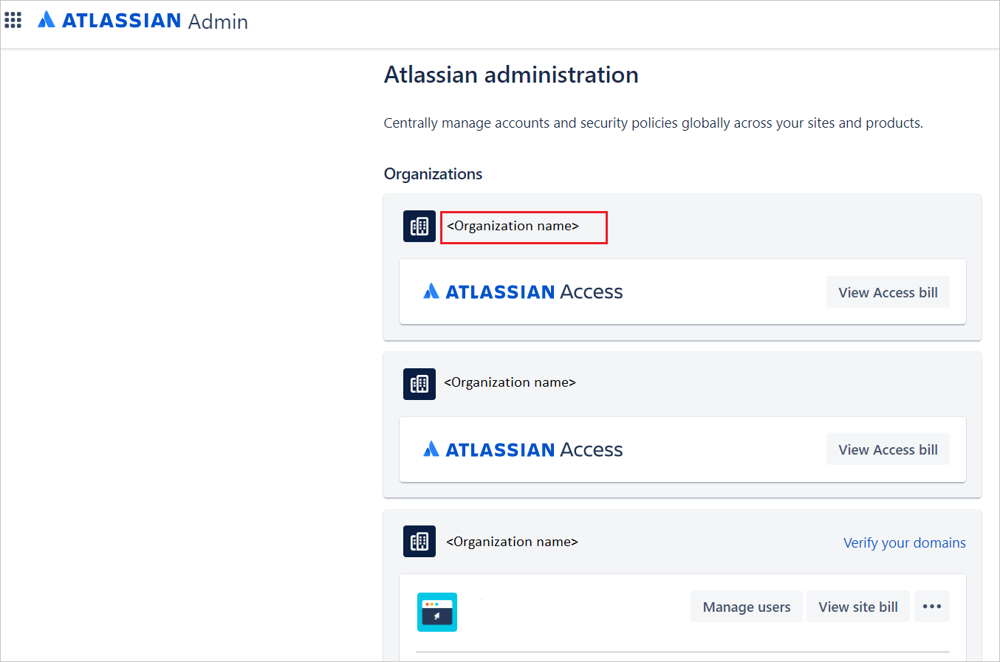

1. Debe comprobar el dominio antes de configurar el inicio de sesión único. Para más información, consulte el documento [Atlassian domain verification](https://confluence.atlassian.com/cloud/domain-verification-873871234.html) (Comprobación del dominio Atlassian).

1. En el portal de **administración de ATLASSIAN**, vaya a la pestaña **Security** (Seguridad), seleccione **SAML single sign-on** (Inicio de sesión único de SAML) y haga clic en **Add SAML configuration** (Agregar configuración de SAML).

   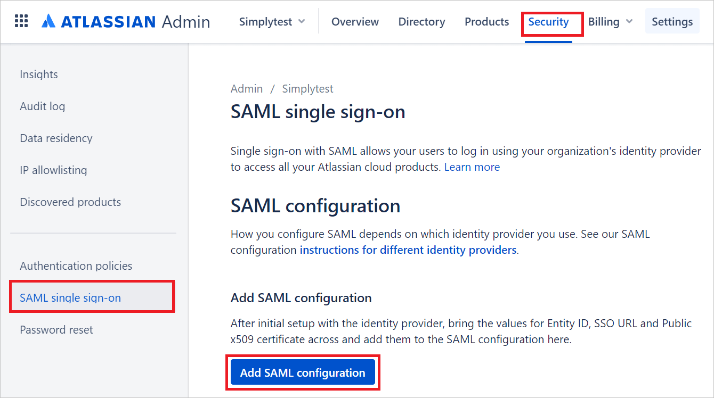

1. En la sección **Add SAML configuration** (Agregar configuración de SAML), rellene los campos obligatorios que ha copiado de Azure Portal y haga clic en **Save configuration** (Guardar configuración).

   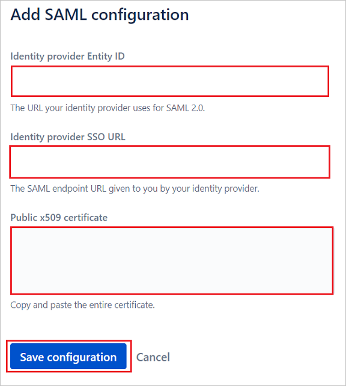

1. En Azure Portal, en la página de integración de la aplicación **Atlassian Cloud**, busque la sección **Administrar** y seleccione **Configurar inicio de sesión único**.

   

1. En la página **Seleccione un método de inicio de sesión único**, seleccione **SAML**.

   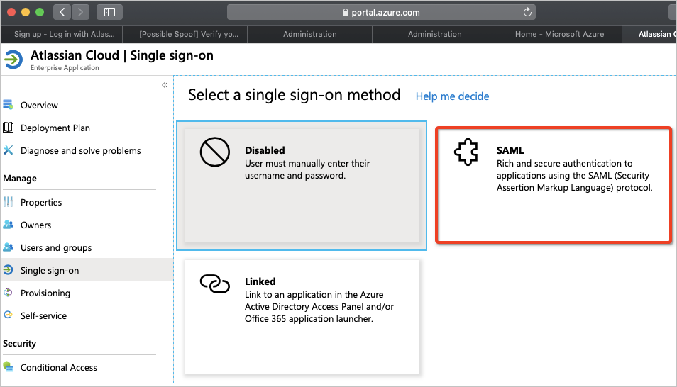

1. En la página **Configuración del inicio de sesión único con SAML**, desplácese hacia abajo hasta **Configurar Atlassian Cloud**.
   
   a. Haga clic en **Direcciones URL de configuración**.

   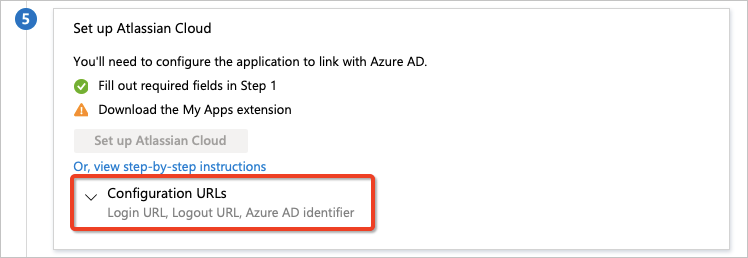
   
   b. Copie el valor de **Identificador de Azure AD** en Azure Portal y péguelo en el cuadro de texto **Identity Provider Entity ID** (Id. de entidad del proveedor de identidades) en Atlassian.
   
   c. Copie el valor de **Dirección URL de inicio de sesión** en Azure Portal y péguelo en el cuadro de texto **Identity Provider SSO URL** (Dirección URL de inicio de sesión único del proveedor de identidades) en Atlassian.

   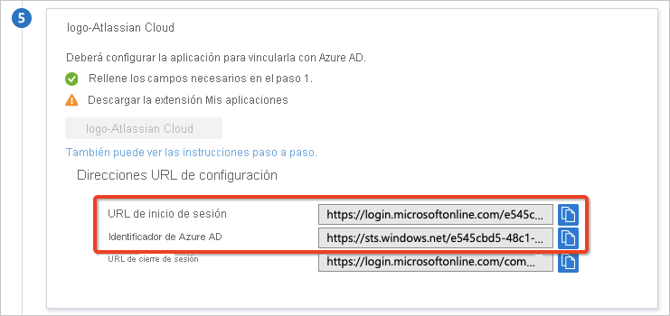

   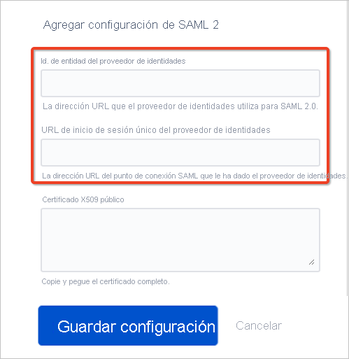

1. En la página **Configurar el inicio de sesión único con SAML**, en la sección **Certificado de firma de SAML**, busque **Certificado (Base64)** y seleccione **Descargar** para descargarlo y guardarlo en el equipo.

   

   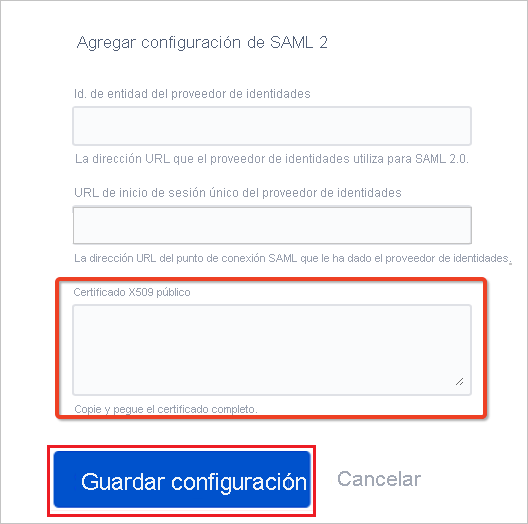

1. **Agregue** y **guarde** la configuración de SAML en Atlassian.

1. En la sección **Configuración básica de SAML**, siga estos pasos.

   a. Copie el valor de **SP Entity ID** (Identificador de entidad del proveedor de servicios) de Atlassian, péguelo en el cuadro **Identificador (id. de entidad)** en Azure y establézcalo como predeterminado.
   
   b. Copie el valor de **SP Assertion Consumer Service URL** (URL del Servicio de consumidor de aserciones) de Atlassian, péguelo en el cuadro **Dirección URL de respuesta (URL del Servicio de consumidor de aserciones)** de Azure y establézcalo como valor predeterminado.
   
   c. Copie el valor de **Dirección URL de la instancia**, que copió en el paso 4 y péguelo en el cuadro **Estado de la retransmisión** de Azure.

   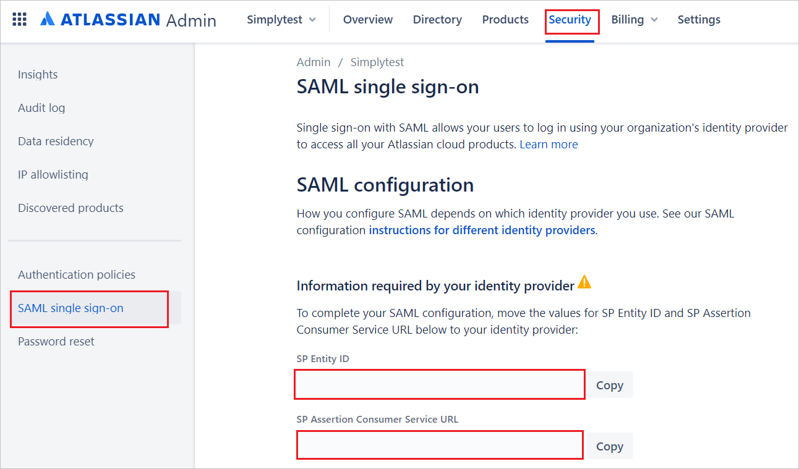

   

   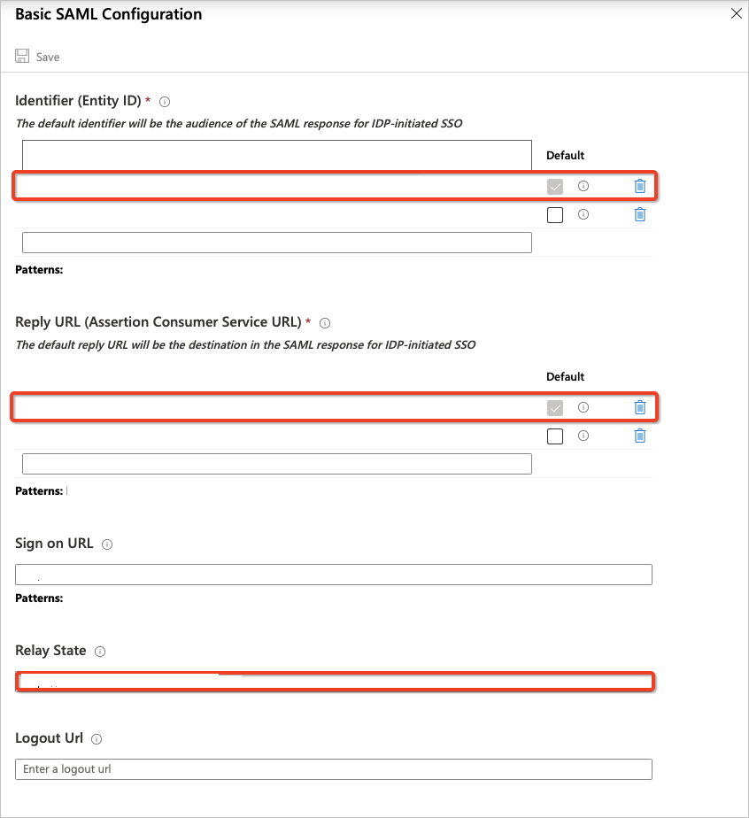
   
1. La aplicación Atlassian Cloud espera las aserciones de SAML en un formato específico, que requiere que se agreguen asignaciones de atributos personalizados a la configuración de los atributos del token de SAML. Para editar la asignación de atributos, haga clic en el icono de **edición**. 

   
   
   1. Asignación de atributos para un inquilino de Azure AD con una licencia de Microsoft 365.
      
      a. Haga clic en la notificación **Identificador de usuario único (id. de nombre)** .

      
      
      b. Atlassian Cloud espera que este **id. de nombre** (**Identificador de usuario único**) se asigne al correo electrónico del usuario (**user.email**). Edite el **atributo de origen** y cámbielo a **user.mail**. Guarde los cambios de la notificación.

      
      
      c. Las asignaciones de atributo finales deben tener el aspecto siguiente.

      
      
   1. Asignación de atributos para un inquilino de Azure AD sin una licencia de Microsoft 365. 

      a. Haga clic en la notificación `http://schemas.xmlsoap.org/ws/2005/05/identity/claims/emailaddress` .

      
         
      b. Aunque Azure no rellena el atributo **user.mail** de los usuarios creados en inquilinos de Azure AD sin licencias de Microsoft 365 y almacena el correo electrónico de esos usuarios en el atributo **userprincipalname**, Atlassian Cloud espera que este **id. de nombre** (**Identificador de usuario único**) se asigne al correo electrónico del usuario (**user.userprincipalname**).  Edite el **atributo de origen** y cámbielo a **user.userprincipalname**. Guarde los cambios de la notificación.

      
         
      c. Las asignaciones de atributo finales deben tener el aspecto siguiente.

      

1. Para aplicar el inicio de sesión único de SAML en una directiva de autenticación, realice los pasos siguientes.

   a.   En el portal de **administración de Atlassian**, seleccione la pestaña **Security** (Seguridad) y haga clic en **Authentication policies** (Directivas de autenticación).

   b.   Seleccione **Edit** (Editar) para la directiva que desea aplicar. 

   c.   En **Settings** (Configuración), habilite **Enforce single sign-on** (Aplicar inicio de sesión único) a sus usuarios administrados para el redireccionamiento correcto de SAML. 

   d.   Haga clic en **Update**(Actualizar). 

      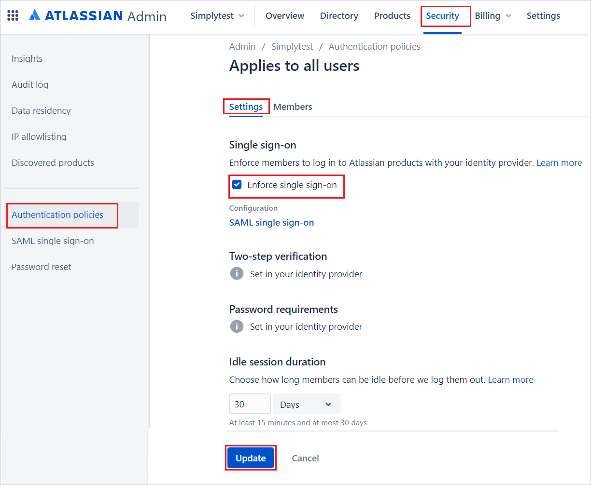 

   > [!NOTE]
   > Los administradores pueden probar la configuración de SAML habilitando solo el inicio de sesión único aplicado para un subconjunto de usuarios primero en una directiva de autenticación independiente y, a continuación, habilitando la directiva para todos los usuarios si no hay ningún problema.

### Creación de un usuario de prueba de Azure AD

En esta sección, va a crear un usuario de prueba llamado B.Simon en Azure Portal.

1. En el panel izquierdo de Azure Portal, seleccione **Azure Active Directory**, **Usuarios** y **Todos los usuarios**.
1. Seleccione **Nuevo usuario** en la parte superior de la pantalla.
1. En las propiedades del **usuario**, siga estos pasos:
   1. En el campo **Nombre**, escriba `B.Simon`.  
   1. En el campo **Nombre de usuario**, escriba username@companydomain.extension. Por ejemplo, `B.Simon@contoso.com`.
   1. Active la casilla **Show password** (Mostrar contraseña) y, después, anote el valor que se muestra en el cuadro **Contraseña**.
   1. Haga clic en **Crear**.

### Asignación del usuario de prueba de Azure AD

En esta sección, va a conceder acceso a B.Simon a Atlassian Cloud para que use el inicio de sesión único de Azure.

1. En Azure Portal, seleccione sucesivamente **Aplicaciones empresariales** y **Todas las aplicaciones**.
1. En la lista de aplicaciones, seleccione **Atlassian Cloud**.
1. En la página de información general de la aplicación, busque la sección **Administrar** y seleccione **Usuarios y grupos**.
1. Seleccione **Agregar usuario**. A continuación, en el cuadro de diálogo **Agregar asignación**, seleccione **Usuarios y grupos**.
1. En el cuadro de diálogo **Usuarios y grupos**, seleccione **B.Simon** de la lista de usuarios y haga clic en el botón **Seleccionar** de la parte inferior de la pantalla.
1. Si espera que se asigne un rol a los usuarios, puede seleccionarlo en la lista desplegable **Seleccionar un rol**. Si no se ha configurado ningún rol para esta aplicación, verá seleccionado el rol "Acceso predeterminado".
1. En el cuadro de diálogo **Agregar asignación**, haga clic en el botón **Asignar**.

### Creación de un usuario de prueba de Atlassian Cloud

Para permitir que los usuarios de Azure AD inicien sesión en Atlassian Cloud, aprovisione las cuentas de usuario manualmente en Atlassian Cloud haciendo lo siguiente:

1. Vaya a la pestaña **Products** (Productos), seleccione **Users** (Usuarios) y haga clic en **Invite users** (Invitar a usuarios).

    

1. En el cuadro texto **Email address** (Dirección de correo electrónico), escriba la dirección de correo electrónico del usuario y, después, haga clic en **Invite user** (Invitar usuario).

    

### Prueba de SSO

En esta sección, probará la configuración de inicio de sesión único de Azure AD con las siguientes opciones. 

#### Iniciado por SP:

* Haga clic en **Probar esta aplicación** en Azure Portal. Esta acción le redirigirá a la dirección URL de inicio de sesión de Atlassian Cloud, donde puede iniciar el flujo de inicio de sesión.  

* Vaya directamente a la dirección URL de inicio de sesión de Atlassian Cloud e inicie el flujo de inicio de sesión desde allí.

#### Iniciado por IDP:

* Haga clic en **Probar esta aplicación** en Azure Portal, y debería iniciarse sesión automáticamente en la instancia de Atlassian Cloud para la que configuró el inicio de sesión único. 

También puede usar Aplicaciones de Microsoft para probar la aplicación en cualquier modo. Al hacer clic en el icono de Atlassian Cloud en Aplicaciones, si se ha configurado en el modo SP, se le redirigirá a la página de inicio de sesión de la aplicación para iniciar el flujo de inicio de sesión. Si se ha configurado en modo IDP, debería iniciarse sesión automáticamente en la instancia de Atlassian Cloud para la que configuró el inicio de sesión único. Para más información acerca de Aplicaciones, consulte [Inicio de sesión e inicio de aplicaciones desde el portal Aplicaciones](../user-help/my-apps-portal-end-user-access.md).

## Pasos siguientes

Una vez configurado Atlassian Cloud, puede aplicar el control de sesión, que protege la filtración y la infiltración de la información confidencial de la organización en tiempo real. El control de sesión procede del acceso condicional. [Aprenda a aplicar el control de sesión con Microsoft Cloud App Security](/cloud-app-security/proxy-deployment-any-app).