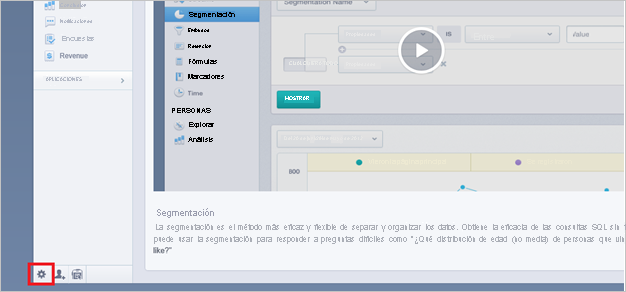
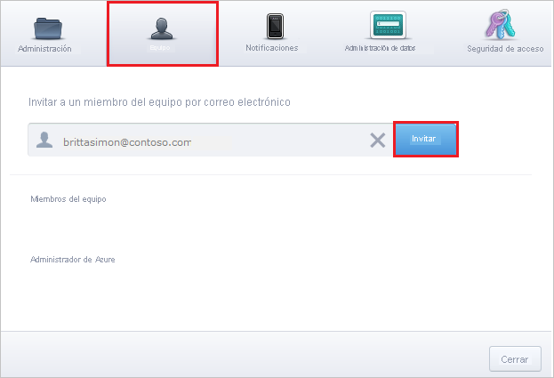

# Tutorial: Integración de Azure Active Directory con Mixpanel

En este tutorial, obtendrá información sobre cómo integrar Mixpanel con Azure Active Directory (Azure AD). Al integrar Mixpanel con Azure AD, puede hacer lo siguiente:

* Controlar en Azure AD quién tiene acceso a Mixpanel.
* Permitir que los usuarios inicien sesión automáticamente en Mixpanel con sus cuentas de Azure AD.
* Administrar las cuentas desde una ubicación central (Azure Portal).

## Requisitos previos

Para empezar, necesita los siguientes elementos:

* Una suscripción de Azure AD. Si no tiene una suscripción, puede crear una [cuenta gratuita](https://azure.microsoft.com/free/).
* Una suscripción habilitada para el inicio de sesión único (SSO) en Mixpanel.

## Descripción del escenario

En este tutorial, puede configurar y probar el inicio de sesión único de Azure AD en un entorno de prueba.

* Mixpanel admite el inicio de sesión único iniciado por **SP**.

* Mixpanel admite el [aprovisionamiento de usuarios automático](mixpanel-provisioning-tutorial.md).

> [!NOTE]
> El identificador de esta aplicación es un valor de cadena fijo, por lo que solo se puede configurar una instancia en un inquilino.

## Adición de Mixpanel desde la galería

Para configurar la integración de Mixpanel en Azure AD, deberá agregar Mixpanel desde la galería a la lista de aplicaciones SaaS administradas.

1. Inicie sesión en Azure Portal con una cuenta personal, profesional o educativa de Microsoft.
1. En el panel de navegación de la izquierda, seleccione el servicio **Azure Active Directory**.
1. Vaya a **Aplicaciones empresariales** y seleccione **Todas las aplicaciones**.
1. Para agregar una nueva aplicación, seleccione **Nueva aplicación**.
1. En la sección **Agregar desde la galería**, escriba **Mixpanel** en el cuadro de búsqueda.
1. Seleccione **Mixpanel** en el panel de resultados y agregue la aplicación. Espere unos segundos mientras la aplicación se agrega al inquilino.

## Configuración y prueba del inicio de sesión único de Azure AD para Mixpanel

Configure y pruebe el inicio de sesión único de Azure AD con Mixpanel mediante un usuario de prueba llamado **B.Simon**. Para que el inicio de sesión único funcione, es preciso establecer una relación de vinculación entre un usuario de Azure AD y el usuario relacionado de Mixpanel.

Para configurar y probar el inicio de sesión único de Azure AD con Mixpanel, siga estos pasos:

1. **[Configuración del inicio de sesión único de Azure AD](#configure-azure-ad-sso)** , para permitir que los usuarios puedan utilizar esta característica.
    1. **[Creación de un usuario de prueba de Azure AD](#create-an-azure-ad-test-user)** , para probar el inicio de sesión único de Azure AD con B.Simon.
    1. **[Asignación del usuario de prueba de Azure AD](#assign-the-azure-ad-test-user)** , para habilitar a B.Simon para que use el inicio de sesión único de Azure AD.
1. **[Configuración del inicio de sesión único en Mixpanel](#configure-mixpanel-sso)** : para configurar los valores de Inicio de sesión único en la aplicación.
    1. **[Creación de un usuario de prueba de Mixpanel](#create-mixpanel-test-user)** : para tener un homólogo de B.Simon en Mixpanel que esté vinculado a la representación del usuario en Azure AD.
1. **[Prueba del inicio de sesión único](#test-sso)** : para comprobar si la configuración funciona.

## Configuración del inicio de sesión único de Azure AD

Siga estos pasos para habilitar el inicio de sesión único de Azure AD en Azure Portal.

1. En Azure Portal, en la página de integración de la aplicación **Mixpanel**, busque la sección **Administrar** y seleccione **Inicio de sesión único**.
1. En la página **Seleccione un método de inicio de sesión único**, elija **SAML**.
1. En la página **Configuración del inicio de sesión único con SAML**, haga clic en el icono de lápiz de **Configuración básica de SAML** para editar la configuración.

   

4. En la sección **Configuración básica de SAML**, siga estos pasos:

    En el cuadro de texto **URL de inicio de sesión**, escriba la dirección URL: `https://mixpanel.com/login/`

    > [!NOTE]
    > Regístrese en [https://mixpanel.com/register/](https://mixpanel.com/register/) para configurar las credenciales de inicio de sesión y póngase en contacto con el [equipo de soporte técnico de Mixpanel](mailto:support@mixpanel.com) para habilitar la configuración de SSO del inquilino. Si es necesario, también puede obtener el valor de la dirección URL de inicio de sesión del equipo de soporte de Mixpanel. 

5. En la página **Configurar el inicio de sesión único con SAML**, en la sección **Certificado de firma de SAML**, haga clic en **Descargar** para descargar el **certificado (Base64)** de las opciones proporcionadas según sus requisitos y guárdelo en el equipo.

    

6. En la sección **Set up Mixpanel** (Configurar Mixpanel), copie las direcciones URL adecuadas según sus necesidades.

    

### Creación de un usuario de prueba de Azure AD 

En esta sección, va a crear un usuario de prueba llamado B.Simon en Azure Portal.

1. En el panel izquierdo de Azure Portal, seleccione **Azure Active Directory**, **Usuarios** y **Todos los usuarios**.
1. Seleccione **Nuevo usuario** en la parte superior de la pantalla.
1. En las propiedades del **usuario**, siga estos pasos:
   1. En el campo **Nombre**, escriba `B.Simon`.  
   1. En el campo **Nombre de usuario**, escriba username@companydomain.extension. Por ejemplo, `B.Simon@contoso.com`.
   1. Active la casilla **Show password** (Mostrar contraseña) y, después, anote el valor que se muestra en el cuadro **Contraseña**.
   1. Haga clic en **Crear**.

### Asignación del usuario de prueba de Azure AD

En esta sección va a permitir que B.Simon acceda a Mixpanel mediante el inicio de sesión único de Azure.

1. En Azure Portal, seleccione sucesivamente **Aplicaciones empresariales** y **Todas las aplicaciones**.
1. En la lista de aplicaciones, seleccione **Mixpanel**.
1. En la página de información general de la aplicación, busque la sección **Administrar** y seleccione **Usuarios y grupos**.
1. Seleccione **Agregar usuario**. A continuación, en el cuadro de diálogo **Agregar asignación**, seleccione **Usuarios y grupos**.
1. En el cuadro de diálogo **Usuarios y grupos**, seleccione **B.Simon** de la lista de usuarios y haga clic en el botón **Seleccionar** de la parte inferior de la pantalla.
1. Si espera que se asigne un rol a los usuarios, puede seleccionarlo en la lista desplegable **Seleccionar un rol**. Si no se ha configurado ningún rol para esta aplicación, verá seleccionado el rol "Acceso predeterminado".
1. En el cuadro de diálogo **Agregar asignación**, haga clic en el botón **Asignar**.

## Configuración del inicio de sesión único de Mixpanel

1. En una ventana de explorador diferente, inicie sesión en su aplicación de Mixpanel como administrador.

2. En la parte inferior de la página, haga clic en el pequeño icono de **engranaje** de la esquina izquierda. 
   
     

3. Haga clic en la pestaña **Access security** (Seguridad de acceso) y después en **Change settings** (Cambiar la configuración).
   
     

4. En la página de diálogo **Change your certificate** (Cambiar su certificado), haga clic en **Choose file** (Elegir archivo) para cargar el certificado descargado y después haga clic en **Next** (Siguiente).
   
     

5.  En el cuadro de texto Authentication URL (Dirección URL de autenticación) de la página de diálogo **Change your authentication URL** (Cambiar la dirección URL de autenticación), pegue el valor de **Login URL** (Dirección URL de inicio de sesión) que ha copiado desde Azure Portal y haga clic en **NEXT** (Siguiente).
   
     

6. Haga clic en **Done**(Listo).

### Creación de un usuario de prueba de Mixpanel

El objetivo de esta sección es crear un usuario de prueba llamado Britta Simon en Mixpanel. 

1. Inicie sesión en su sitio de la compañía de Mixpanel como administrador.

2. En la parte inferior de la página, haga clic en el pequeño icono de engranaje en la esquina izquierda para abrir la ventana **Configuración** .

3. Haga clic en la pestaña **Equipo** .

4. En el cuadro de texto de **miembro del equipo** , escriba la dirección de correo electrónico de Britta en Azure.
   
     

5. Haga clic en **Invitar**. 

> [!Note]
> El usuario recibirá un correo electrónico para configurar el perfil.

> [!NOTE]
> Mixpanel también admite el aprovisionamiento automático de usuarios; [aquí](./mixpanel-provisioning-tutorial.md) encontrará más detalles sobre cómo configurarlo.

## Prueba de SSO

En esta sección, probará la configuración de inicio de sesión único de Azure AD con las siguientes opciones. 

* Haga clic en **Probar esta aplicación** en Azure Portal. Esta acción le redirigirá a la URL de inicio de sesión de Mixpanel, desde donde puede poner en marcha el flujo de inicio de sesión. 

* Vaya directamente a la dirección URL de inicio de sesión de Mixpanel e inicie el flujo de inicio de sesión desde allí.

* Puede usar Mis aplicaciones de Microsoft. Al hacer clic en el icono de Mixpanel en Aplicaciones, se le redirigirá a la URL de inicio de sesión de la aplicación. Para más información acerca de Aplicaciones, consulte [Inicio de sesión e inicio de aplicaciones desde el portal Aplicaciones](../user-help/my-apps-portal-end-user-access.md).

## Pasos siguientes

Una vez configurado Mixpanel, puede aplicar el control de sesión, que protege la filtración y la infiltración de la información confidencial de la organización en tiempo real. El control de sesión procede del acceso condicional. [Aprenda a aplicar el control de sesión con Microsoft Cloud App Security](/cloud-app-security/proxy-deployment-aad).