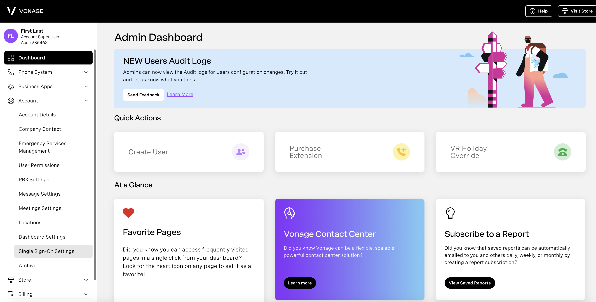
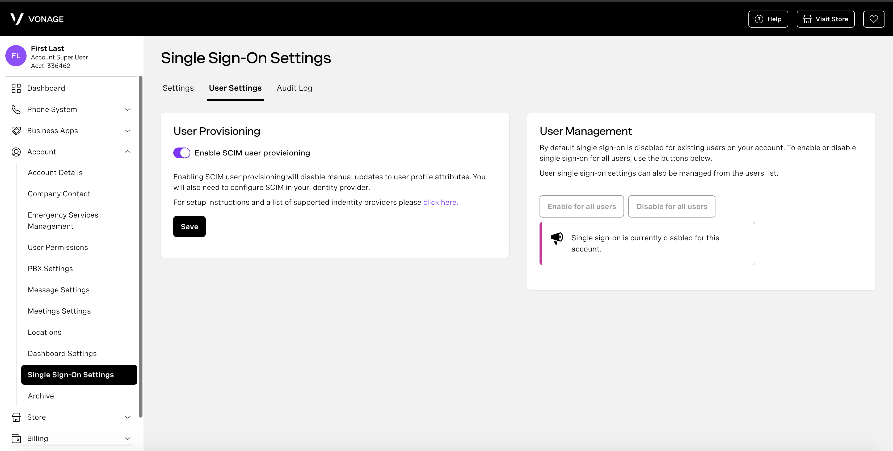
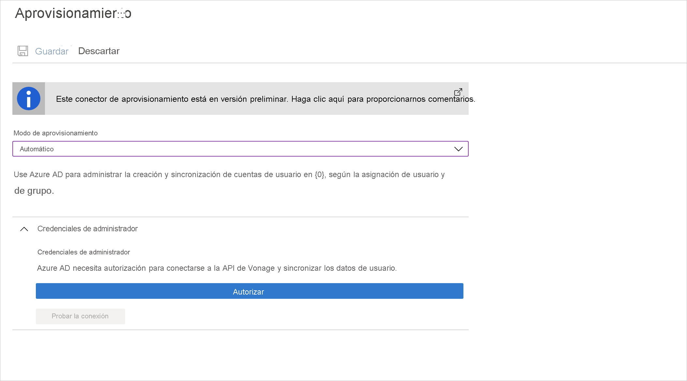

# Tutorial: Configuración de Vonage para el aprovisionamiento automático de usuarios

En este tutorial, se describen los pasos que debe realizar en Vonage y Azure Active Directory (Azure AD) para configurar el aprovisionamiento automático de usuarios. Cuando se configura, Azure AD aprovisiona y cancela el aprovisionamiento de usuarios y grupos de manera automática en [Vonage](https://www.vonage.com/) mediante el servicio de aprovisionamiento de Azure AD. Para obtener información importante acerca de lo que hace este servicio, cómo funciona y ver preguntas frecuentes al respecto, consulte [Automatización del aprovisionamiento y desaprovisionamiento de usuarios para aplicaciones SaaS con Azure Active Directory](../app-provisioning/user-provisioning.md). 

## Funcionalidades admitidas
> [!div class="checklist"]
> * Creación de usuarios en Vonage.
> * Eliminación de usuarios de Vonage cuando ya no necesitan acceso.
> * Mantenimiento de los atributos de usuario sincronizados entre Azure AD y Vonage.
> * [Inicio de sesión único](vonage-tutorial.md) en Vonage (recomendado).

## Requisitos previos

En el escenario descrito en este tutorial se supone que ya cuenta con los requisitos previos siguientes:

* [Un inquilino de Azure AD](../develop/quickstart-create-new-tenant.md). 
* Una cuenta de usuario en Azure AD con [permiso](../roles/permissions-reference.md) para configurar el aprovisionamiento (por ejemplo, Administrador de aplicaciones, Administrador de aplicaciones en la nube, Propietario de la aplicación o Administrador global). 
* Un inquilino de [Vonage](https://www.vonage.com/).
* Una cuenta de usuario en Vonage con permiso de administrador (superusuario de cuenta).

## Paso 1. Planeación de la implementación de aprovisionamiento
1. Obtenga información sobre [cómo funciona el servicio de aprovisionamiento](../app-provisioning/user-provisioning.md).
1. Determine quién estará en el [ámbito de aprovisionamiento](../app-provisioning/define-conditional-rules-for-provisioning-user-accounts.md).
1. Determine qué datos se van a [asignar entre Azure AD y Vonage](../app-provisioning/customize-application-attributes.md). 

## Paso 2. Configuración de Vonage para admitir el aprovisionamiento con Azure AD

1. Inicie sesión en el [portal de administración de Vonage](http://admin.vonage.com) con un usuario administrador.

   

1. Vaya a **Cuenta > Configuración de inicio de sesión único** en el menú situado en el lado izquierdo.

   

1. Seleccione la pestaña **User settings** (Configuración del usuario), active **Enable SCIM user provisioning** (Habilitar aprovisionamiento de usuario de SCIM) y haga clic en **Save** (Guardar).

## Paso 3. Adición de Vonage desde la galería de aplicaciones de Azure AD

Para empezar a administrar el aprovisionamiento de Vonage, agregue Vonage desde la galería de aplicaciones de Azure AD. Si ha configurado previamente Vonage para el inicio de sesión único, puede usar la misma aplicación. Sin embargo, se recomienda que cree una aplicación independiente al probar la integración inicialmente. Puede encontrar más información sobre cómo agregar una aplicación desde la galería [aquí](../manage-apps/add-application-portal.md).

## Paso 4. Determinar quién estará en el ámbito de aprovisionamiento 

El servicio de aprovisionamiento de Azure AD le permite definir quién se aprovisionará, en función de la asignación a la aplicación y de los atributos del usuario o grupo. Si elige el ámbito del que se aprovisionará en la aplicación en función de la asignación, puede usar los pasos [siguientes](../manage-apps/assign-user-or-group-access-portal.md) para asignar usuarios y grupos a la aplicación. Si elige el ámbito del que se aprovisionará en función únicamente de los atributos del usuario o grupo, puede usar un filtro de ámbito, tal como se describe [aquí](../app-provisioning/define-conditional-rules-for-provisioning-user-accounts.md). 

* Al asignar usuarios y grupos a Vonage, debe seleccionar un rol que no sea **Acceso predeterminado**. Los usuarios con el rol de acceso predeterminado se excluyen del aprovisionamiento y se marcarán como no autorizados en los registros de aprovisionamiento. Si el único rol disponible en la aplicación es el rol de acceso predeterminado, puede [actualizar el manifiesto de aplicación](../develop/howto-add-app-roles-in-azure-ad-apps.md) para agregar roles adicionales. 

* Empiece por algo pequeño. Pruebe con un pequeño conjunto de usuarios y grupos antes de implementarlo en todos. Cuando el ámbito del aprovisionamiento se define en los usuarios y grupos asignados, puede controlarlo asignando uno o dos usuarios o grupos a la aplicación. Cuando el ámbito se establece en todos los usuarios y grupos, puede especificar un [filtro de ámbito basado en atributos](../app-provisioning/define-conditional-rules-for-provisioning-user-accounts.md). 

## Paso 5. Configuración del aprovisionamiento automático de usuarios en Vonage 

> [!NOTE]
>  Cualquier usuario que se agregue a Vonage debe tener nombre, apellidos y correo electrónico. De lo contrario, se producirá un error en la integración.

Esta sección le guía por los pasos necesarios para configurar el servicio de aprovisionamiento de Azure AD para crear, actualizar y deshabilitar usuarios o grupos en Vonage en función de las asignaciones de grupos y usuarios de Azure AD.

### Para configurar el aprovisionamiento automático de usuarios para Vonage en Azure AD, siga estos pasos:

1. Inicie sesión en [Azure Portal](https://portal.azure.com). Seleccione **Aplicaciones empresariales** y luego **Todas las aplicaciones**.

    

1. En la lista de aplicaciones, seleccione **Vonage**.

    

1. Seleccione la pestaña **Aprovisionamiento**.

    

1. Establezca el **modo de aprovisionamiento** en **Automático**.

    

1. Antes del paso siguiente, asegúrese de que está autorizado como superusuario de la cuenta. Para comprobar si el usuario es un superusuario de la cuenta, inicie sesión en el [portal de administración de Vonage](http://admin.vonage.com).
   Debería ver en la parte superior izquierda una imagen similar a la siguiente.

   

1. En la sección **Credenciales de administrador**, haga clic en Autorizar, asegúrese de que especifica las credenciales de superusuario de la cuenta; si no le pide que escriba las credenciales, asegúrese de que ha iniciado sesión con el superusuario de la cuenta (puede comprobarlo en http://admin.vonage.com/ en la parte superior izquierda, junto a su nombre debe aparecer "Superusuario de la cuenta"). Haga clic en **Probar conexión** para asegurarse de que Azure AD puede conectarse a Vonage. Si la conexión no se establece, asegúrese de que la cuenta de Vonage tiene permisos de administrador e inténtelo de nuevo.

   
1. En el campo **Correo electrónico de notificación**, escriba la dirección de correo electrónico de una persona o grupo que deba recibir las notificaciones de error de aprovisionamiento y active la casilla **Enviar una notificación por correo electrónico cuando se produzca un error**.

    

1. Seleccione **Guardar**.

1. En la sección de **asignaciones**, seleccione **Synchronize Azure Active Directory Users to Vonage** (Sincronizar usuarios de Azure Active Directory con Vonage).

1. Revise los atributos de usuario que se sincronizan entre Azure AD y Vonage en la sección **Asignación de atributos**. Los atributos seleccionados como propiedades de **Coincidencia** se usan para buscar coincidencias con las cuentas de usuario de Vonage con el objetivo de realizar operaciones de actualización. Si decide cambiar el [atributo de destino coincidente](../app-provisioning/customize-application-attributes.md), deberá asegurarse de que la API de Vonage admite el filtrado de usuarios basado en ese atributo. Seleccione el botón **Guardar** para confirmar los cambios.

   |Atributo|Tipo|Compatible con el filtrado|
   |---|---|---|
   |userName|String|&check;
   |active|Boolean|   
   |emails[type eq "work"].value|String|
   |name.givenName|String|
   |name.familyName|String|

1. Para configurar filtros de ámbito, consulte las siguientes instrucciones, que se proporcionan en el artículo [Aprovisionamiento de aplicaciones basado en atributos con filtros de ámbito](../app-provisioning/define-conditional-rules-for-provisioning-user-accounts.md).

1. Para habilitar el servicio de aprovisionamiento de Azure AD para Vonage, cambie el **estado de aprovisionamiento** a **Activado** en la sección **Configuración**.

    

1. Elija los valores deseados en **Ámbito**, en la sección **Configuración**, para definir los usuarios o grupos que desea que se aprovisionen en Vonage.

    

1. Cuando esté listo para realizar el aprovisionamiento, haga clic en **Guardar**.

    

Esta operación inicia el ciclo de sincronización inicial de todos los usuarios y grupos definidos en **Ámbito** en la sección **Configuración**. El ciclo de sincronización inicial tarda más tiempo en realizarse que los ciclos posteriores, que se producen aproximadamente cada 40 minutos si el servicio de aprovisionamiento de Azure AD está ejecutándose. 

## Paso 6. Supervisión de la implementación
Una vez configurado el aprovisionamiento, use los recursos siguientes para supervisar la implementación:

* Use los [registros de aprovisionamiento](../reports-monitoring/concept-provisioning-logs.md) para determinar qué usuarios se han aprovisionado correctamente o sin éxito.
* Consulte la [barra de progreso](../app-provisioning/application-provisioning-when-will-provisioning-finish-specific-user.md) para ver el estado del ciclo de aprovisionamiento y cuánto falta para que finalice.
* Si la configuración de aprovisionamiento parece estar en mal estado, la aplicación pasará a estar en cuarentena. Más información sobre los estados de cuarentena [aquí](../app-provisioning/application-provisioning-quarantine-status.md).  

## Más recursos

* [Administración del aprovisionamiento de cuentas de usuario para aplicaciones empresariales](../app-provisioning/configure-automatic-user-provisioning-portal.md)
* [¿Qué es el acceso a aplicaciones y el inicio de sesión único con Azure Active Directory?](../manage-apps/what-is-single-sign-on.md)

## Pasos siguientes

* [Aprenda a revisar los registros y a obtener informes sobre la actividad de aprovisionamiento](../app-provisioning/check-status-user-account-provisioning.md)