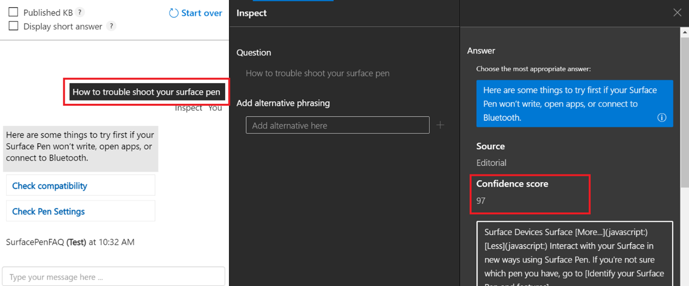

# <a name="improve-quality-of-response-with-synonyms"></a>Mejora de la calidad de las respuestas con sinónimos

En este tutorial se muestra cómo puede mejorar la calidad de las respuestas mediante sinónimos. Supongamos que los usuarios no están obteniendo una respuesta precisa a sus consultas cuando usan formas alternativas, sinónimos o acrónimos de una palabra. Por lo tanto, deciden mejorar la calidad de la respuesta mediante [Alterations API](/rest/api/cognitiveservices-qnamaker/QnAMaker4.0/Alterations) para agregar sinónimos para palabras clave.

## <a name="add-synonyms-using-alterations-api"></a>Adición de sinónimos mediante Alterations API

Vamos a agregar las siguientes palabras y sus formas alternativas para mejorar los resultados:

|Word | Formas alternativas|
|--------------|--------------------------------|
| fix problems (solucionar problemas) | `Troubleshoot`, `trouble-shoot`|
| whiteboard (pizarra)   | `white-board`, `white board`   |
| Bluetooth    | `blue-tooth`, `blue tooth`     |

```json
{
    "wordAlterations": [
        {
            "alterations": [
                "fix problems",
                "trouble shoot",
                "trouble-shoot",
                ]
        },
        {
            "alterations": [
                "whiteboard",
                "white-board",
                "white board"
            ]
        },
        {
            "alterations": [
                "bluetooth",
                "blue-tooth",
                "blue tooth"
            ]
        }
    ]
}

```

## <a name="response-after-adding-synonyms"></a>Respuesta después de la adición de sinónimos

Para el par de preguntas y respuestas "Corregir problemas del lápiz de Surface" que se muestra a continuación, comparamos la respuesta de una consulta realizada con su sinónimo "solución de problemas".

> [!div class="mx-imgBorder"]
> [  ]( ../media/adding-synonyms/fix-problems.png#lightbox)

## <a name="response-before-addition-of-synonym"></a>Respuesta antes de adición del sinónimo

> [!div class="mx-imgBorder"]
> [  ]( ../media/adding-synonyms/confidence-score.png#lightbox)

## <a name="response-after-addition-of-synonym"></a>Respuesta después de la adición del sinónimo 

> [!div class="mx-imgBorder"]
> [  ]( ../media/adding-synonyms/increase-score.png#lightbox)

Como puede ver, cuando no se agregó `trouble shoot` como sinónimo, se obtuvo una respuesta de confianza baja a la consulta "Cómo solucionar problemas del lápiz de Surface". Sin embargo, después de agregar `trouble shoot` como sinónimo de "solucionar problemas", recibimos la respuesta correcta a la consulta con una puntuación de confianza mayor. Una vez agregadas estas formas alternativas de palabras, se mejoró la relevancia de los resultados, lo cual mejora la experiencia del usuario. 

> [!NOTE]
> Los sinónimos no distinguen mayúsculas de minúsculas. Es posible que los sinónimos tampoco funcionen según lo previsto si agrega palabras no significativas como sinónimos. La lista de palabras no significativas se puede encontrar aquí: [Lista de palabras no significativas](https://github.com/Azure-Samples/azure-search-sample-data/blob/master/STOPWORDS.md).

Por ejemplo, si agrega la abreviatura de **TI** para tecnología de la información, es posible que el sistema no pueda reconocer "tecnología de la información" porque **TI** es una palabra no significativa y se filtra cuando se procesa la consulta.

## <a name="next-steps"></a>Pasos siguientes

> [!div class="nextstepaction"]
> [Creación de knowledge bases en varios idiomas](multiple-languages.md)