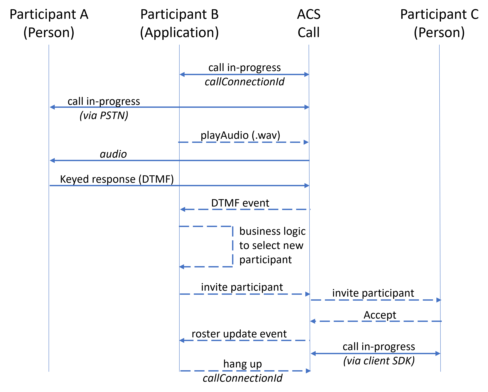
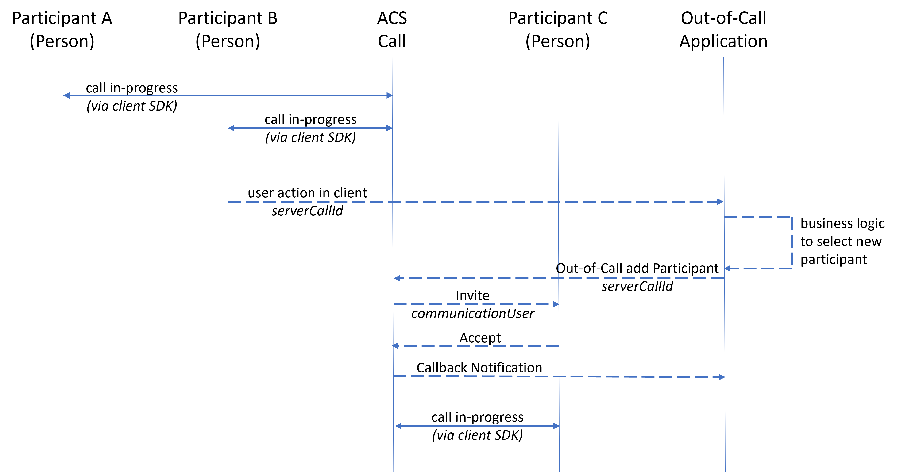

# Introducción a Call Automation

[!INCLUDE [Public Preview](../../includes/public-preview-include-document.md)]

Call Automation API le permite acceder a las funcionalidades de llamadas de voz y vídeo desde los **servicios**. Puede usar estas API para crear aplicaciones de servicio que generen llamadas de recordatorio de salida automatizadas para citas o que proporcionen notificaciones proactivas para eventos como interrupciones del suministro eléctrico o incendios. Las aplicaciones de servicio que se unen a una llamada pueden supervisar las actualizaciones a medida que los participantes se unen o salen, lo que le permite implementar útiles funcionalidades de registro y generación de informes.

Las instancias de Call Automation API se proporcionan para las acciones en la llamada (participante de la aplicación) y para las acciones fuera de la llamada. Hay dos diferencias clave entre estos conjuntos de API:
- Las API en llamada requieren que la aplicación se una a la llamada como participante. Los participantes de la aplicación se facturan según las [tarifas estándar de RTC y VoIP](https://azure.microsoft.com/pricing/details/communication-services/).
- Las API en llamada usan el `callConnectionId` asociado al participante de la aplicación, mientras que las API fuera de llamada usan el `serverCallId` asociado a la instancia de la llamada. 

## Casos de uso
| Caso de uso                                                       | En llamada (participante de la aplicación) | Fuera de llamada   |
| ---------------------------------------------------------------| ------------------------- | ------------- |
| Realizar o recibir llamadas individuales entre el bot y los participantes humanos  | X                         |               |
| Reproducir mensajes de audio y escuchar las respuestas                    | X                         |               |
| Supervisión de eventos en llamada                                         | X                         |               |
| Creación de llamadas con varios participantes                        | X                         |               |
| Obtener los participantes de la llamada y los detalles de estos                  | X                         |               |
| Agregar o quitar participantes de las llamadas                                | X                         | X             |
| Acciones en el lado servidor en llamadas del mismo nivel (por ejemplo, grabación)     |                           | X             |
| Reproducir anuncios de audio para todos los participantes                   |                           | X             |
| Inicia y administrar la grabación de llamadas                                |                           | X             |

## API en llamada (participante de la aplicación)

Las API en llamada permiten a una aplicación realizar acciones en una llamada como participante de la aplicación. Cuando una aplicación responde o se une a una llamada, se asigna un `callConnectionId` que se usa para acciones en llamada como:
- Agregar o quitar participantes de las llamadas
- Reproducir mensajes de audio y escuchar las respuestas de DTMF
- Escuchar eventos y actualizaciones de listas de llamadas
- Colgar una llamada

### Eventos en llamada
Las notificaciones de eventos se envían como cargas JSON a la aplicación que realiza la llamada a través del conjunto `callbackUri` al unirse a la llamada. Los eventos que se envían a los participantes de la aplicación en llamada son:
- Eventos CallState (Estableciendo, Establecido, Finalizando, Finalizado)
- DTMF recibido
- Reproducción del resultado de audio
- Cancelar procesamiento multimedia
- Resultado de invitación de participante
- Participantes actualizados

## API fuera de llamada
Las API fuera de llamada permiten realizar acciones en una llamada o reunión sin tener un participante de la aplicación presente. Las API fuera de llamada usan el `serverCallId` que proporciona el SDK de cliente de llamadas o que se genera cuando se crea una llamada mediante Call Automation API. Dado que las API fuera de llamada no requieren un participante de la aplicación, son útiles para implementar lógica de negocios del lado servidor en llamadas al mismo nivel. Por ejemplo, considere un escenario de llamada de soporte técnico que se inició como una llamada del mismo nivel y el agente (participante B) quiere invitar a un experto en la materia para que ayude. El participante B desencadena un evento en la interfaz de cliente de una aplicación de servidor para identificar a un experto en la materia disponible e invitarlo a la llamada. El estado final del flujo que se muestra a continuación es una llamada de grupo con tres participantes humanos.

Las API fuera de llamada están disponibles para acciones como:
- Agregar o quitar participantes de las llamadas
- Iniciar, detener, pausar y reanudar la grabación de llamadas
                                                       
### Eventos fuera de llamada
Las notificaciones de eventos se envían como cargas JSON a la aplicación que realiza la llamada a través del elemento `callbackUri` que se proporciona en la llamada API original. Las acciones con los eventos fuera de llamada correspondientes son:
- Grabación de llamadas (Iniciar, Detener, Pausar, Reanudar)
- Resultado de invitación de participante

## Pasos siguientes
Consulte el [inicio rápido de Call Automation](../../quickstarts/voice-video-calling/call-automation-api-sample.md) para más información.
