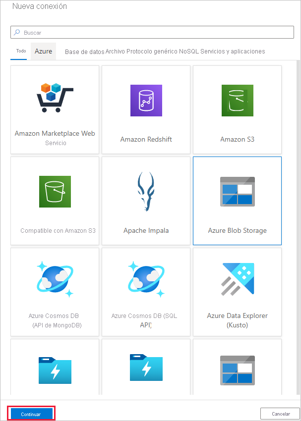
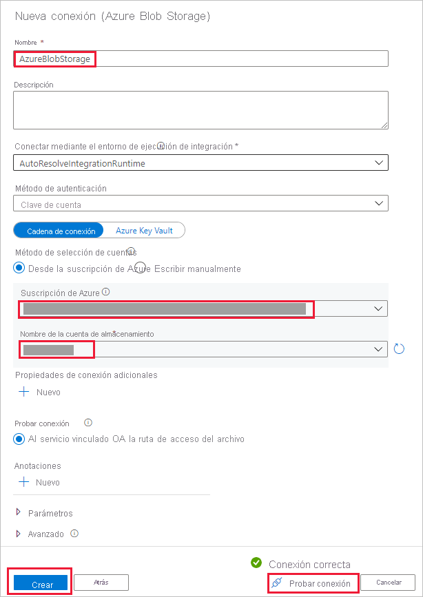
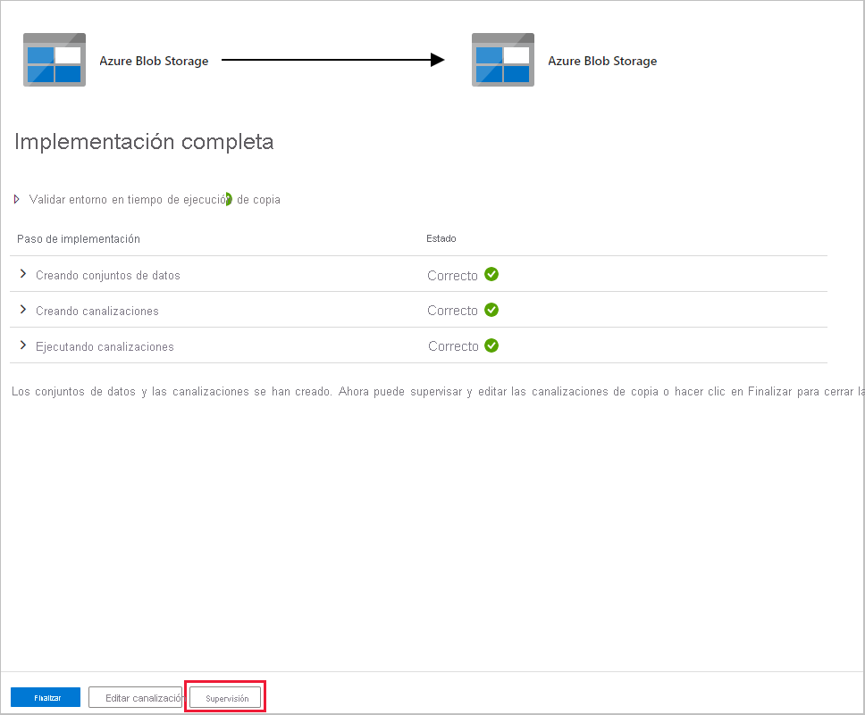
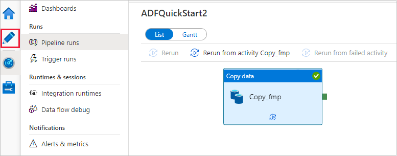

# Inicio rápido: Uso de la herramienta Copy Data para copiar datos

> [!div class="op_single_selector" title1="Seleccione la versión del servicio Data Factory que usa:"]
> * [Versión 1](v1/data-factory-copy-data-from-azure-blob-storage-to-sql-database.md)
> * [Versión actual](quickstart-create-data-factory-copy-data-tool.md)

[!INCLUDE[appliesto-adf-xxx-md](includes/appliesto-adf-xxx-md.md)]

En esta guía de inicio rápido, usará Azure Portal para crear una factoría de datos. A continuación, usará la herramienta Copy Data para crear una canalización que copia datos de una carpeta de una instancia de Azure Blob Storage a otra carpeta. 

> [!NOTE]
> Si no está familiarizado con Azure Data Factory, consulte [Introduction to Azure Data Factory](introduction.md) antes de seguir los pasos de esta guía de inicio rápido. 

[!INCLUDE [data-factory-quickstart-prerequisites](includes/data-factory-quickstart-prerequisites.md)] 

## Crear una factoría de datos

1. Inicie el explorador web **Microsoft Edge** o **Google Chrome**. Actualmente, la interfaz de usuario de Data Factory solo se admite en los exploradores web Microsoft Edge y Google Chrome.
1. Vaya a [Azure Portal](https://portal.azure.com). 
1. En el menú de Azure Portal, seleccione **Crear un recurso** > **Integración** > **Data Factory**:

    

1. En la página **Nueva factoría de datos**, escriba **ADFTutorialDataFactory** en **Nombre**. 
 
   El nombre de la instancia de Azure Data Factory debe ser *único de forma global*. Si ve el siguiente error, cambie el nombre de la factoría de datos (por ejemplo, **&lt;suNombre&gt;ADFTutorialDataFactory**) e intente crearlo de nuevo. Para conocer las reglas de nomenclatura de los artefactos de Data Factory, consulte el artículo [Azure Data Factory: reglas de nomenclatura](naming-rules.md).
  
   
1. En **Suscripción**, seleccione la suscripción de Azure donde desea crear la factoría de datos. 
1. Para **Grupo de recursos**, realice uno de los siguientes pasos:
     
   - Seleccione en primer lugar **Usar existente** y después un grupo de recursos de la lista. 
   - Seleccione **Crear nuevo** y escriba el nombre de un grupo de recursos.   
         
   Para obtener más información sobre los grupos de recursos, consulte [Uso de grupos de recursos para administrar los recursos de Azure](../azure-resource-manager/management/overview.md).  
1. En **Versión**, seleccione **V2**.
1. En **Ubicación**, seleccione la ubicación de la factoría de datos.

   En la lista solo se muestran las ubicaciones que admite Data Factory y dónde se almacenarán los metadatos de Azure Data Factory. Los almacenes de datos asociados (como Azure Storage y Azure SQL Database) y los procesos (como Azure HDInsight) que usa Data Factory se pueden ejecutar en otras regiones.

1. Seleccione **Crear**.

1. Una vez completada la creación, verá la página **Data Factory**. Seleccione **Abrir** en el icono **Abrir Azure Data Factory Studio** para iniciar la aplicación de interfaz de usuario (IU) de Azure Data Factory en una pestaña independiente.
   
    :::image type="content" source="./media/doc-common-process/data-factory-home-page.png" alt-text="Página principal de Azure Data Factory, con el icono Abrir Azure Data Factory Studio.":::
    
## Inicio de la herramienta Copy Data

1. En la página principal de Azure Data Factory, seleccione el icono **Ingest** (Ingerir) para iniciar la herramienta Copiar datos.

   

1. En la página **Propiedades** de la herramienta Copiar datos, elija **Tarea de copia integrada** en **Tipo de tarea** y, a continuación, seleccione **Siguiente**.

   

1. En la página **Almacén de datos de origen**, realice los pasos siguientes:

    1. Haga clic en **+ Crear nueva conexión** para agregar una conexión.

    1. Seleccione el tipo de servicio vinculado que desea crear para la conexión de origen. En este tutorial, se usará **Azure Blob Storage**. Selecciónelo en la galería y, luego, elija **Continuar**.
    
       

    1. En la página **New connection (Azure Blob Storage)** [Nueva conexión (Azure Blob Storage)], especifique un nombre para el servicio vinculado. Seleccione la suscripción a Azure de la lista **Suscripción a Azure** y la cuenta de almacenamiento de la lista **Nombre de la cuenta de almacenamiento**, pruebe la conexión y, a continuación, seleccione **Crear**. 

       

    1. Seleccione la conexión recién creada en el bloque **Conexión**.
    1. En la sección **Archivo o carpeta**, seleccione **Examinar** para ir a la carpeta **adftutorial/input**, seleccione el archivo **emp.txt** y, finalmente, haga clic en **Aceptar**.
    1. Seleccione la casilla **Binary copy** (Copia binaria) para copiar el archivo tal cual está, después, seleccione **Siguiente**.

       :::image type="content" source="./media/quickstart-create-data-factory-copy-data-tool/source-data-store.png" alt-text="Captura de pantalla que muestra la página Almacén de datos de origen.":::

1. En la página **Almacén de datos de destino**, realice los pasos siguientes:
    1. Seleccione la conexión **AzureBlobStorage** que creó en el bloque **Conexión**.

    1. En la sección **Ruta de acceso de carpeta**, escriba **adftutorial/output** para la ruta de acceso de la carpeta.

       :::image type="content" source="./media/quickstart-create-data-factory-copy-data-tool/destination-data-store.png" alt-text="Captura de pantalla que muestra la página Almacén de datos de destino.":::

    1. Deje otras opciones con sus valores predeterminados y, a continuación, seleccione **Siguiente**.

1. En la página **Configuración**, especifique un nombre para la canalización y su descripción y, a continuación, seleccione **Siguiente** para usar otras configuraciones predeterminadas. 

    :::image type="content" source="./media/quickstart-create-data-factory-copy-data-tool/settings.png" alt-text="Captura de pantalla que muestra la página Configuración.":::

1. En la página **Resumen**, revise todos los valores y seleccione **Siguiente**. 

1. En la página **Deployment complete** (Implementación finalizada), haga clic en **Monitor** (Supervisión) para supervisar la canalización que ha creado. 

    

1. La aplicación cambia a la pestaña **Monitor** (Supervisión). En esta pestaña verá el estado de la canalización. Seleccione **Refresh** (Actualizar) para actualizar la lista. Haga clic en el vínculo en **Nombre de canalización** para ver los detalles de la ejecución de actividad o volver a ejecutar la canalización. 
   
    

1. En la página Ejecuciones de actividad, seleccione el vínculo **Detalles** (icono de gafas) en la columna **Nombre de actividad** para obtener más detalles sobre la operación de copia. Para más información sobre las propiedades, consulte [Introducción a la actividad de copia](copy-activity-overview.md). 

1. Para volver a la vista Ejecuciones de canalizaciones, seleccione el vínculo **Todas las ejecuciones de la canalización** en el menú de la ruta de navegación. Para actualizar la vista, seleccione **Refresh** (Actualizar). 

1. Compruebe que se crea el archivo **emp.txt** en la carpeta **output** del contenedor **adftutorial**. Si no existe la carpeta de salida, el servicio Data Factory la crea automáticamente. 

1. Cambie a la pestaña **Creador** situada encima de la pestaña **Supervisar** del panel izquierdo para editar los servicios, conjuntos de datos y canalizaciones vinculados. Para saber cómo editarlos en la interfaz de usuario de Data Factory, consulte [Crear una factoría de datos mediante Azure Portal](quickstart-create-data-factory-portal.md).

    

## Pasos siguientes
La canalización de este ejemplo copia los datos de una ubicación a otra en una instancia de Azure Blob Storage. Para más información sobre el uso de Data Factory en otros escenarios, consulte los siguientes [tutoriales](tutorial-copy-data-portal.md). 
