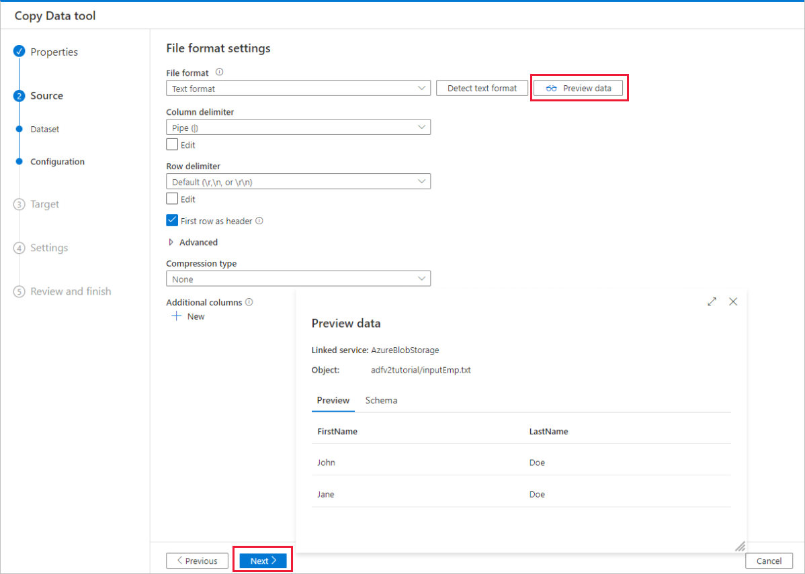
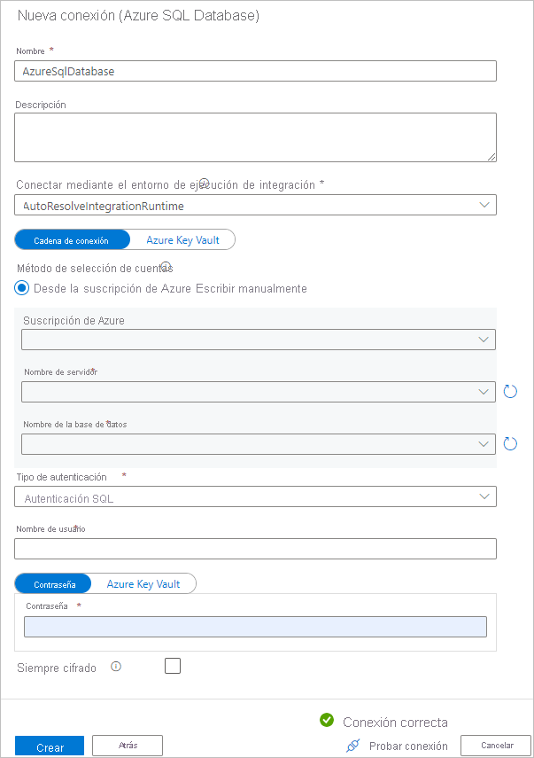
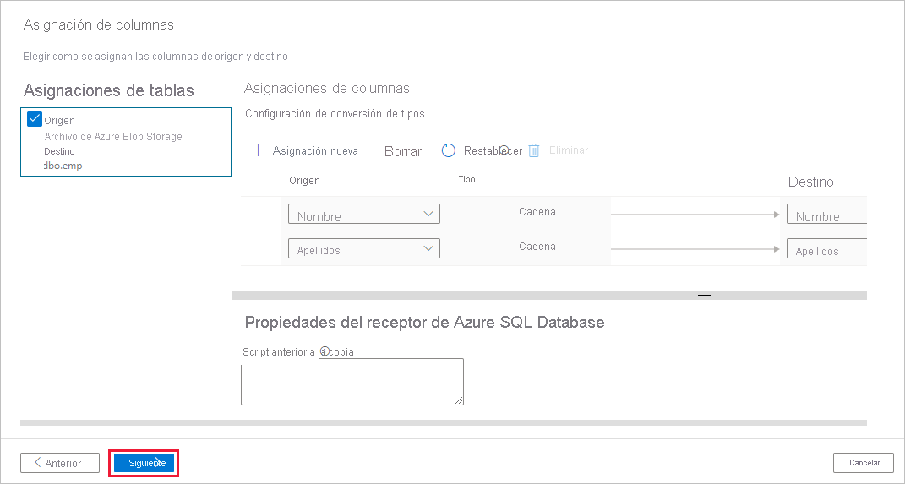
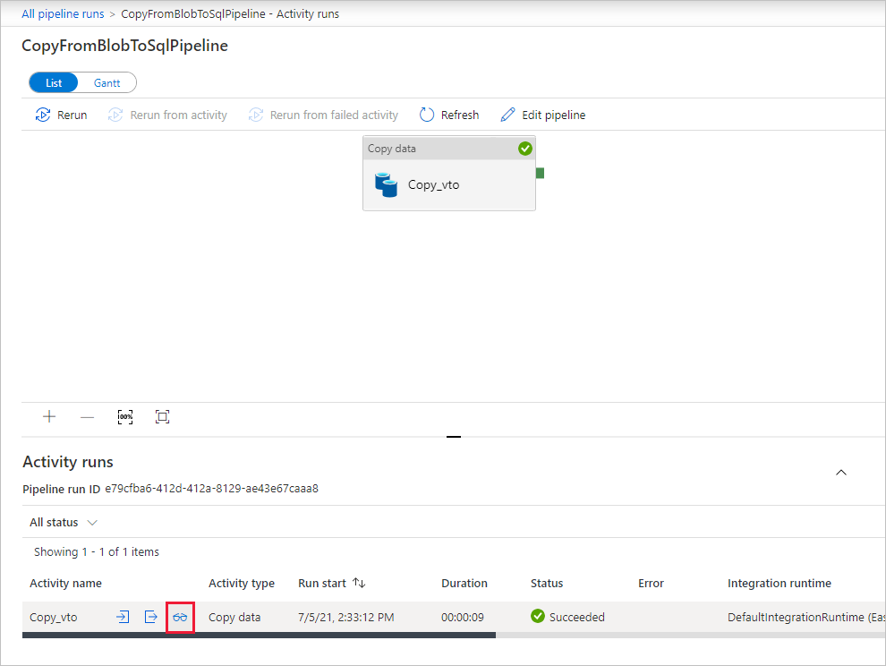
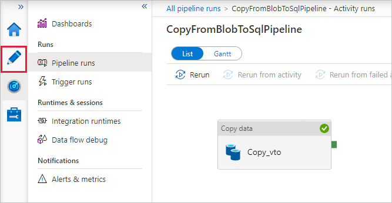

# <a name="copy-data-from-azure-blob-storage-to-a-sql-database-by-using-the-copy-data-tool"></a>Copia de datos de Azure Blob Storage a SQL Database con la herramienta Copy Data

> [!div class="op_single_selector" title1="Seleccione la versión del servicio Data Factory que usa:"]
> * [Versión 1](v1/data-factory-copy-data-from-azure-blob-storage-to-sql-database.md)
> * [Versión actual](tutorial-copy-data-tool.md)

[!INCLUDE[appliesto-adf-asa-md](includes/appliesto-adf-asa-md.md)]

En este tutorial, usará Azure Portal para crear una factoría de datos. A continuación, usará la herramienta Copy Data para crear una canalización que copia datos de una instancia de Azure Blob Storage a una instancia de SQL Database.

> [!NOTE]
> Si no está familiarizado con Azure Data Factory, consulte [Introducción a Azure Data Factory](introduction.md).

En este tutorial, realizará los siguientes pasos:
> [!div class="checklist"]
> * Creación de una factoría de datos.
> * Uso de la herramienta Copy Data para crear una canalización.
> * Supervisión de las ejecuciones de canalización y actividad.

## <a name="prerequisites"></a>Requisitos previos

* **Suscripción de Azure**: Si no tiene una suscripción a Azure, cree una [cuenta gratuita](https://azure.microsoft.com/free/) antes de empezar.
* **Cuenta de Azure Storage**: use Blob Storage como almacén de datos de _origen_. Si no dispone de una cuenta de Azure Storage, consulte las instrucciones de [Creación de una cuenta de Azure Storage](../storage/common/storage-account-create.md).
* **Azure SQL Database**: use una instancia de SQL Database como almacén de datos _receptor_. Si no tiene una instancia de SQL Database, consulte las instrucciones de [Creación de una instancia de Azure SQL Database](../azure-sql/database/single-database-create-quickstart.md).

### <a name="create-a-blob-and-a-sql-table"></a>Creación de un blob y una tabla SQL

Prepare su instancia de Blob Storage y su instancia de SQL Storage para el tutorial mediante los pasos siguientes.

#### <a name="create-a-source-blob"></a>Creación de un blob de origen

1. Inicie el **Bloc de notas**. Copie el texto siguiente y guárdelo en un archivo llamado **inputEmp.txt** en el disco:

   ```text
   FirstName|LastName
   John|Doe
   Jane|Doe
   ```

1. Cree un contenedor denominado **adfv2tutorial** y cargue el archivo inputEmp.txt en el contenedor. Puede usar Azure Portal o varias herramientas como el [Explorador de Azure Storage](https://storageexplorer.com/) para realizar estas tareas.

#### <a name="create-a-sink-sql-table"></a>Creación de una tabla SQL receptora

1. Use el siguiente script de SQL para crear una tabla llamada **dbo.emp** en la instancia de SQL Database:

   ```sql
   CREATE TABLE dbo.emp
   (
       ID int IDENTITY(1,1) NOT NULL,
       FirstName varchar(50),
       LastName varchar(50)
   )
   GO
   CREATE CLUSTERED INDEX IX_emp_ID ON dbo.emp (ID);
   ```

2. Permita que los servicios de Azure accedan a SQL Server. Compruebe que el valor **Permitir que los servicios y recursos de Azure accedan a este servidor** está habilitado para el servidor que ejecuta SQL Database. Esta configuración permite que Data Factory escriba datos en su instancia de base de datos. Para verificar y activar esta configuración, vaya al servidor lógico de SQL > Seguridad > Firewalls y redes virtuales, y establezca la opción **Permitir que los servicios y recursos de Azure accedan a este servidor** en **Activada**.

   > [!NOTE]
   > La opción para **permitir que los servicios y recursos de Azure accedan a este servidor** permite el acceso de red a SQL Server desde cualquier recurso de Azure, no solo desde los de su suscripción. Para más información, consulte [Reglas de firewall de Azure SQL Server](../azure-sql/database/firewall-configure.md). En su lugar, puede usar [puntos de conexión privados](../private-link/private-endpoint-overview.md) para conectarse a los servicios de Azure PaaS sin usar IP públicas.

## <a name="create-a-data-factory"></a>Crear una factoría de datos

1. En el menú de la izquierda, seleccione **Crear un recurso** > **Integración** > **Data Factory**:

   

1. En la página **Nueva factoría de datos**, en **Nombre**, escriba **ADFTutorialDataFactory**.

   El nombre de la factoría de datos debe ser _globalmente único_. Puede aparecer el siguiente mensaje de error:

   :::image type="content" source="./media/doc-common-process/name-not-available-error.png" alt-text="Nuevo mensaje de error de factoría de datos por nombre duplicado.":::

   Si recibe un mensaje de error sobre el valor de nombre, escriba un nombre diferente para la factoría de datos. Por ejemplo, utilice _**suNombre**_**ADFTutorialDataFactory**. Para conocer las reglas de nomenclatura de los artefactos de Data Factory, consulte [Data Factory: reglas de nomenclatura](naming-rules.md).

1. Seleccione la **suscripción** de Azure en la que quiere crear la nueva factoría de datos.

1. Para **Grupo de recursos**, realice uno de los siguientes pasos:

   a. Seleccione en primer lugar **Usar existente** y después un grupo de recursos de la lista desplegable.

   b. Seleccione **Crear nuevo** y escriba el nombre de un grupo de recursos.

   Para más información sobre los grupos de recursos, consulte [Uso de grupos de recursos para administrar los recursos de Azure](../azure-resource-manager/management/overview.md).

1. En **Versión**, seleccione **V2** como versión.

1. En **Ubicación**, seleccione la ubicación de la factoría de datos. Solo las ubicaciones admitidas se muestran en la lista desplegable. Los almacenes de datos (por ejemplo, Azure Storage y SQL Database) y los procesos (por ejemplo, Azure HDInsight) que usa la factoría de datos pueden estar en otras ubicaciones o regiones.

1. Seleccione **Crear**.

1. Una vez finalizada la creación, se muestra la página principal de **Data Factory**.

   :::image type="content" source="./media/doc-common-process/data-factory-home-page.png" alt-text="Página principal de Azure Data Factory, con el icono Abrir Azure Data Factory Studio.":::

1. Para iniciar la aplicación de interfaz de usuario (IU) de Azure Data Factory en una pestaña independiente del explorador, seleccione **Abrir** en el icono **Abrir Azure Data Factory Studio**.

## <a name="use-the-copy-data-tool-to-create-a-pipeline"></a>Uso de la herramienta Copy Data para crear una canalización

1. En la página principal de Azure Data Factory, seleccione el icono **Introducción** para iniciar la herramienta Copiar datos.

   

1. En la página **Propiedades** de la herramienta Copiar datos, elija **Tarea de copia integrada** en **Tipo de tarea** y, a continuación, seleccione **Siguiente**.

     
    
1. En la página **Almacén de datos de origen**, realice los pasos siguientes:

   a. Seleccione **+ Crear nueva conexión** para agregar una conexión.

   b. Seleccione **Azure Blob Storage** en la galería y, a continuación, seleccione **Continue** (Continuar).

   c. En la página **New connection (Azure Blob Storage)** [Nueva conexión (Azure Blob Storage)], seleccione la suscripción a Azure de la lista **Suscripción a Azure** y la cuenta de almacenamiento de la lista **Nombre de la cuenta de almacenamiento**. Pruebe la conexión y, después, seleccione **Create** (Crear).

   d. Seleccione el servicio vinculado recién creado como origen y, después, el bloque **Conexión**.

   e. En la sección **Archivo o carpeta**, seleccione **Examinar** para ir a la carpeta **adfv2tutorial**, luego, el archivo **inputEmp.txt** y, finalmente, **Aceptar**.

   f. Seleccione **Siguiente** para ir al siguiente paso.

   :::image type="content" source="./media/tutorial-copy-data-tool/source-data-store.png" alt-text="Configuración del origen.":::

1. En la página **File format settings** (Configuración del formato de archivo), active la casilla para *First row as header* (Primera fila como encabezado). Observe que la herramienta detecta automáticamente los delimitadores de columna y fila; puede obtener una vista previa de los datos y ver el esquema de los datos de entrada seleccionando el botón **Vista previa de datos** de esta página. Luego, seleccione **Siguiente**. 

   

1. En la página **Almacén de datos de destino**, realice los pasos siguientes:

   a. Seleccione **+ Crear nueva conexión** para agregar una conexión.

   b. Seleccione **Azure SQL Database** en la galería y, luego, elija **Continuar**.

   c. En la página **New connection (Azure SQL Database)** [Nueva conexión (Azure SQL Database)], seleccione la suscripción de Azure, el nombre del servidor y el nombre de la base de datos en la lista desplegable. A continuación, seleccione **Autenticación de SQL** en **Tipo de autenticación**, y especifique el nombre de usuario y la contraseña. Pruebe la conexión y seleccione **Crear**.

   

   d. Seleccione el servicio vinculado recién creado como receptor y, después, seleccione **Siguiente**.

1. En la página **Almacén de datos de destino**, seleccione **Usar tablas existentes** y la tabla **dbo.emp**. Luego, seleccione **Siguiente**.

1. En la página **Column mapping** (Asignación de columnas), observe que las columnas segunda y tercera del archivo de entrada se asignan a las columnas **FirstName** y **LastName** de la tabla **emp**. Ajuste la asignación para asegurarse de que no haya ningún error y, después, seleccione **Next** (Siguiente).

   

1. En la página **Configuración**, en **Nombre de tarea**, escriba **CopyFromBlobToSqlPipeline** y, a continuación, seleccione **Siguiente**.

   :::image type="content" source="./media/tutorial-copy-data-tool/settings.png" alt-text="Configuración de los valores.":::

1. En la página **Summary** (Resumen), revise la configuración y seleccione **Next** (Siguiente).

1. En la página **Implementación**, seleccione **Monitor** para supervisar la canalización (tarea).

   

1. En la página Pipeline runs (Ejecuciones de canalización), seleccione **Refresh** (Actualizar) para actualizar la lista. Seleccione el vínculo en **Nombre de canalización** para ver los detalles de la ejecución de actividad o volver a ejecutar la canalización. 

   

1. En la página "Ejecuciones de actividad", seleccione el vínculo **Detalles** (icono de gafas) en la columna **Nombre de actividad** para obtener más detalles sobre la operación de copia. Para volver a la vista "Ejecuciones de canalización", seleccione el vínculo **Todas las ejecuciones de la canalización** en el menú de la ruta de navegación. Para actualizar la vista, seleccione **Refresh** (Actualizar).

   

1. Compruebe que los datos se insertan en la tabla **dbo.emp** de SQL Database.

1. Seleccione la pestaña **Author** (Crear) de la izquierda para cambiar al modo de edición. Con el editor puede actualizar los servicios vinculados, los conjuntos de datos y las canalizaciones creados mediante la herramienta. Para más información sobre la edición de estas entidades en la interfaz de usuario de Data Factory, consulte [la versión de Azure Portal de este tutorial](tutorial-copy-data-portal.md).

   

## <a name="next-steps"></a>Pasos siguientes
La canalización de este ejemplo copia los datos de una instancia de Blob Storage a una instancia de SQL Database. Ha aprendido a:

> [!div class="checklist"]
> * Creación de una factoría de datos.
> * Uso de la herramienta Copy Data para crear una canalización.
> * Supervisión de las ejecuciones de canalización y actividad.

Para aprender a copiar datos desde el entorno local a la nube, avance al tutorial siguiente:

>[!div class="nextstepaction"]
>[Copia de datos del entorno local a la nube](tutorial-hybrid-copy-data-tool.md)
