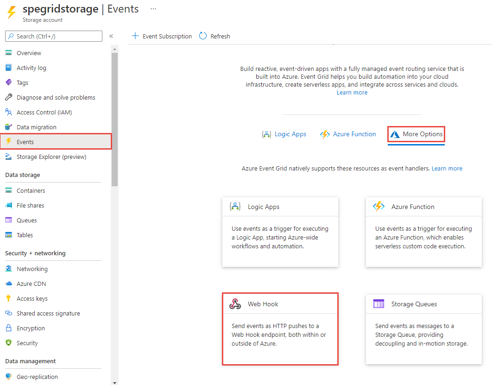
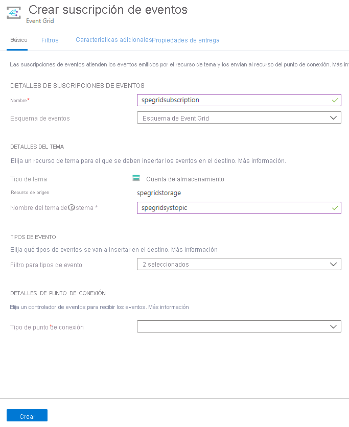
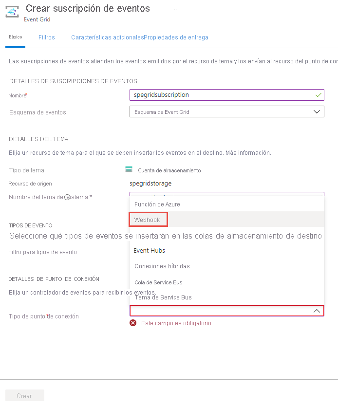
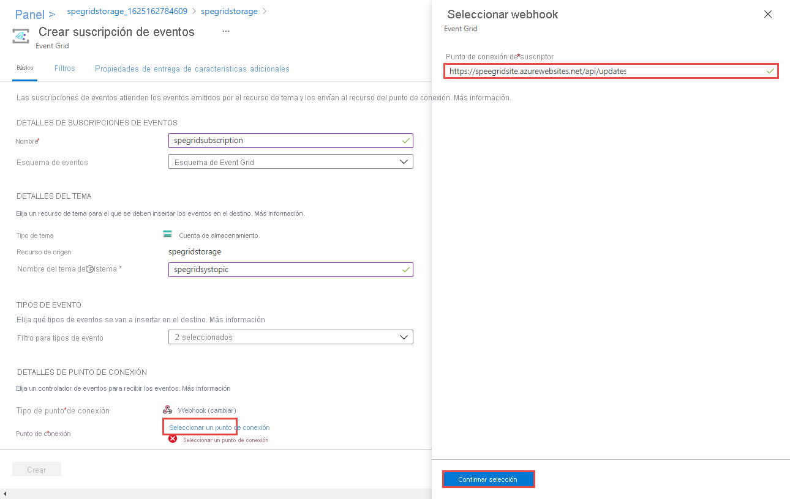
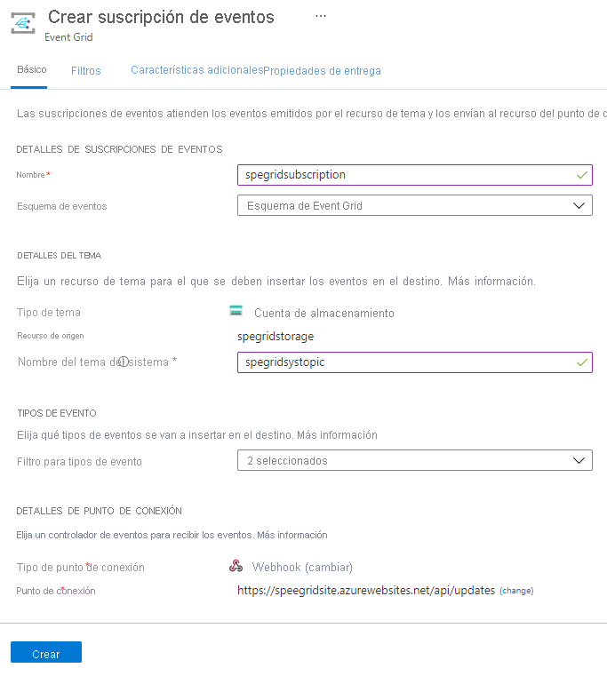
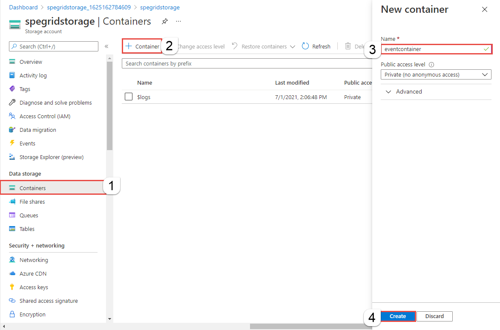
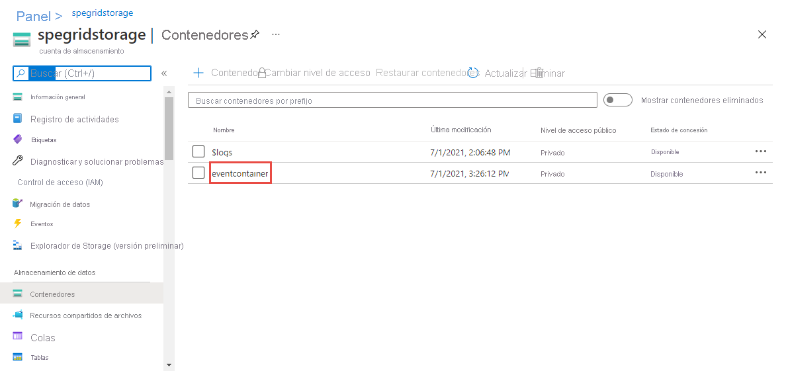
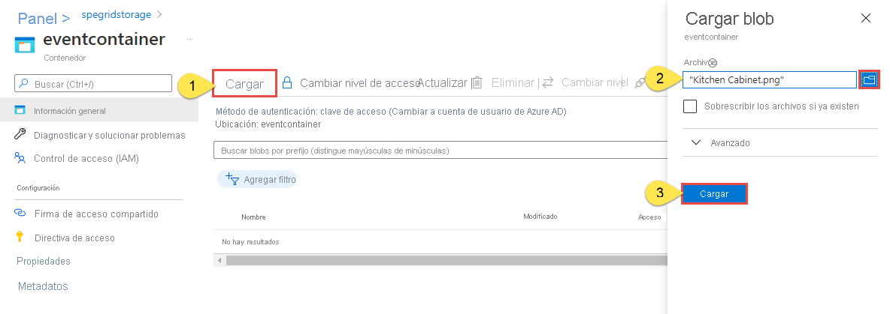

# Uso de Azure Event Grid para enrutar eventos de Blob Storage a un punto de conexión web (Azure Portal)
Event Grid es un servicio totalmente administrado que le permite administrar fácilmente eventos en muchos servicios y aplicaciones de Azure diferentes. Simplifica la creación de aplicaciones controladas por eventos y sin servidor. Para obtener información general sobre el servicio, consulte [¿Qué es Azure Event Grid?](overview.md)

En este artículo, se usa Azure Portal para realizar las siguientes tareas:

1. Crear una cuenta de Blob Storage.
1. Suscribirse a los eventos de ese almacenamiento de blobs.
1. Desencadenar un evento mediante la carga de un archivo en Blob Storage.
1. Ver el resultado en una aplicación web de controlador. Por lo general, se envían eventos a un punto de conexión que procesa los datos del evento y realiza acciones. Para simplificar, los eventos se envían a una aplicación web que recopila y muestra los mensajes.

[!INCLUDE [quickstarts-free-trial-note.md](../../includes/quickstarts-free-trial-note.md)]

Cuando haya terminado, verá que los datos del evento se han enviado a la aplicación web.

## Crear una cuenta de almacenamiento

1. Inicie sesión en el [portal de Azure](https://portal.azure.com/).
1. Para crear una instancia de Blob Storage, seleccione **Crear un recurso**. 
1. En **Buscar**, escriba **Cuenta de almacenamiento** y seleccione **Cuenta de almacenamiento** en la lista de resultados. 

    :::image type="content" source="./media/blob-event-quickstart-portal/search-storage-account.png" alt-text="Captura de pantalla que muestra la búsqueda de cuenta de almacenamiento en la página Crear un recurso.":::
1. En la página **Cuenta de almacenamiento**, seleccione **Crear** para empezar a crear la cuenta de almacenamiento. Para suscribirse a eventos, cree una cuenta de almacenamiento de uso general v2 o una cuenta de Blob Storage.   
1. En la página **Crear cuenta de almacenamiento**, siga estos pasos:
    1. Seleccione su suscripción a Azure. 
    2. En **Grupo de recursos**, cree un nuevo grupo de recursos o seleccione uno existente. 
    3. Escriba el nombre de la cuenta de almacenamiento. 
    1. Seleccione la **Región** en la que quiere que se cree la cuenta de almacenamiento. 
    1. En **Redundancia**, seleccione **Almacenamiento con redundancia local (LRS)** en la lista desplegable. 
    1. Seleccione **Revisar + crear**. 

        :::image type="content" source="./media/blob-event-quickstart-portal/create-storage-account-page.png" alt-text="Captura de pantalla que muestra la página Crear una cuenta de almacenamiento.":::
    5. En la página **Revisar y crear**, examine la configuración y seleccione **Crear**. 

        >[!NOTE]
        > Solo las cuentas de almacenamiento de tipo **StorageV2 (uso general v2)** y **BlobStorage** admiten la integración de eventos. **Storage (uso general v1)** *no* admite la integración con Event Grid.

## Creación de un punto de conexión de mensaje
Antes de suscribirse a los eventos de Blob Storage, vamos a crear el punto de conexión para el mensaje del evento. Normalmente, el punto de conexión realiza acciones en función de los datos del evento. Para simplificar esta guía de inicio rápido, se implementa una [aplicación web pregenerada](https://github.com/Azure-Samples/azure-event-grid-viewer) que muestra los mensajes de los eventos. La solución implementada incluye un plan de App Service, una aplicación web de App Service y el código fuente desde GitHub.

1. Seleccione **Deploy to Azure** (Implementar en Azure) para implementar la solución en su suscripción. 

   
2. En la página **Implementación personalizada**, siga estos pasos: 
    1. En **Grupo de recursos**, seleccione el grupo de recursos que usó para crear la cuenta de almacenamiento. Cuando acabe el tutorial elimine el grupo de recursos.  
    2. En **Nombre del sitio**, escriba el nombre de la aplicación web.
    3. En **Nombre del plan de hospedaje**, escriba el nombre del plan de App Service que se va a usar para hospedar la aplicación web.
    5. Seleccione **Revisar + crear**. 

        :::image type="content" source="./media/blob-event-quickstart-portal/template-deploy-parameters.png" alt-text="Captura de pantalla que muestra la página Implementación personalizada.":::
1. En la página **Revisar y crear**, seleccione **Crear**. 
1. La implementación puede tardar unos minutos en completarse. Seleccione Alertas (el icono de la campana) en el portal y, después, seleccione **Ir al grupo de recursos**. 

    
4. En la página **Grupo de recursos**, en la lista de recursos, seleccione la aplicación web que ha creado. En esta lista también se ven el plan de App Service y la cuenta de almacenamiento. 

    
5. En la página **App Service** de la aplicación web, seleccione la dirección URL para ir al sitio web. La dirección URL debe tener este formato: `https://<your-site-name>.azurewebsites.net`.
    
    

6. Confirme que ve el sitio, pero que aún no se han publicado eventos en él.

   

[!INCLUDE [event-grid-register-provider-portal.md](../../includes/event-grid-register-provider-portal.md)]

## Suscripción a Blob Storage

Suscríbase a un tema que indique a Event Grid los eventos cuyo seguimiento desea realizar y el lugar al que deben enviarse los eventos.

1. En el portal, vaya a la cuenta de Azure Storage que creó antes. En el menú de la izquierda, seleccione **Todos los recursos** y seleccione su cuenta de almacenamiento. 
2. En la página **Cuenta de almacenamiento**, seleccione **Eventos** en el menú de la izquierda. 
1. Seleccione **Más opciones** y **Webhook**. Al enviar los eventos a la aplicación de visor, va a usar un webhook como punto de conexión. 

   
3. En la página **Crear suscripción de eventos**, realice los siguientes pasos: 
    1. Escriba un **nombre** para la suscripción a eventos.
    2. Escriba un **nombre** para el **tema del sistema**. Para obtener información acerca de los temas del sistema, consulte [Introducción a los temas del sistema](system-topics.md).

       
    2. En **Webhook**, seleccione **Tipo de punto de conexión**. 

       
4. En **Punto de conexión**, haga clic en **Seleccionar un extremo**, escriba la dirección URL de la aplicación web y agregue `api/updates` a la dirección URL de la página principal (por ejemplo: `https://spegridsite.azurewebsites.net/api/updates`) y, después, seleccione **Confirmar selección**.

   
5. Ahora, en la página **Crear suscripción de eventos**, seleccione **Crear**. 

   

1. Vuelva a la aplicación web y observe que se ha enviado un evento de validación de suscripción. Seleccione el icono del ojo para expandir los datos del evento. Event Grid envía el evento de validación para que el punto de conexión pueda verificar que desea recibir datos de eventos. La aplicación web incluye código para validar la suscripción.

   

Ahora, vamos a desencadenar un evento para ver cómo Event Grid distribuye el mensaje al punto de conexión.

## Envío de un evento al punto de conexión

Desencadenará un evento para Blob Storage mediante la carga de un archivo. El archivo no necesita ningún contenido específico. En los artículos se da por hecho que tiene un archivo llamado testfile.txt, pero puede usar cualquier archivo.

1. En Azure Portal, vaya a la cuenta de Blob Storage y seleccione **Contenedores** en el menú de la izquierda.
1. Seleccione **+ Contenedor**. Asigne un nombre al contenedor, use cualquier nivel de acceso, y seleccione **Crear**. 

   
1. Seleccione el nuevo contenedor.

   
1. Para cargar un archivo, seleccione **Cargar**. En la página **Cargar blob**, busque y seleccione el archivo que desea cargar para las pruebas y, después, seleccione **Cargar** en la página. 

   
1. Busque el archivo de prueba y cárguelo.
1. Ha desencadenado el evento y Event Grid ha enviado el mensaje al punto de conexión que configuró al realizar la suscripción. El mensaje está en formato JSON y contiene una matriz con uno o más eventos. En el ejemplo siguiente, el mensaje JSON contiene una matriz con un evento. Vea la aplicación web y observe que se ha recibido un evento de **blob creado**. 

   

## Limpieza de recursos

Si piensa seguir trabajando con este evento, no limpie los recursos creados en este artículo. De lo contrario, elimine los recursos que ha creado en este artículo.

Seleccione el grupo de recursos y seleccione **Eliminar grupo de recursos**.

## Pasos siguientes

Ahora que sabe cómo crear suscripciones a temas personalizados y eventos, aprenda más acerca de cómo puede ayudarle Event Grid:

- [Una introducción a Azure Event Grid](overview.md)
- [Enrutamiento de eventos de Blob Storage a un punto de conexión web personalizado](../storage/blobs/storage-blob-event-quickstart.md?toc=%2fazure%2fevent-grid%2ftoc.json)
- [Supervisión de los cambios en máquinas virtuales con Azure Event Grid y Logic Apps](monitor-virtual-machine-changes-event-grid-logic-app.md)
- [Transmisión de macrodatos a un almacén de datos](event-grid-event-hubs-integration.md)
